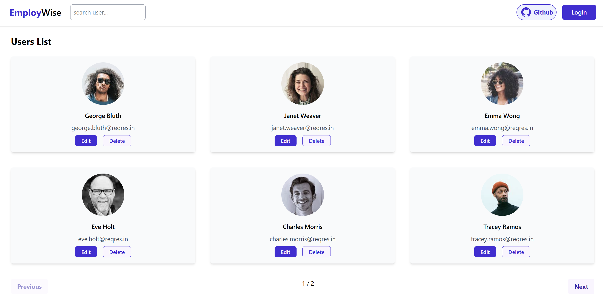

# 🚀EmployWise Hub

A React-based user management application that interacts with the Reqres API. Built with Vite for fast development and optimized performance.

## 🌐 Live Demo
🔗 [EmployWise Hub](https://employwisehub.netlify.app/users)

## 🏠 Home



## ✨ Features
- Fetch and display users from the Reqres API
- Navigate between different pages using React Router
- Styled with Tailwind CSS for a clean UI

## Installation & Setup

### Prerequisites
Ensure you have the following installed:
- **Node.js** (>=14 recommended)
- **npm** 

### Clone the Repository
```sh
git clone https://github.com/shelavalepallavi/employwise.git
```

### Install Dependencies
```sh
npm install
```

### Run the Development Server
```sh
npm run dev
```
This will start a local server, and you can access the app at `http://localhost:5173` (default Vite port).

## Dependencies
The project uses the following dependencies:
- **React Router** - For client-side routing
- **Axios** - For API requests
- **Tailwind CSS** - For styling

### Additional Considerations
- The app fetches data from the **Reqres API** (https://reqres.in/)
- Ensure you have a stable internet connection for API requests
- Modify `vite.config.js` if deploying to a subdirectory (e.g., GitHub Pages)

## Deployment
The app is deployed on **Netlify**. To deploy your own version:
1. Push the repository to GitHub
2. Connect the repository to Netlify
3. Set the build command: `npm run build`
4. Set the publish directory: `dist`


